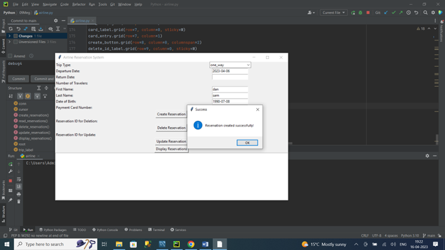
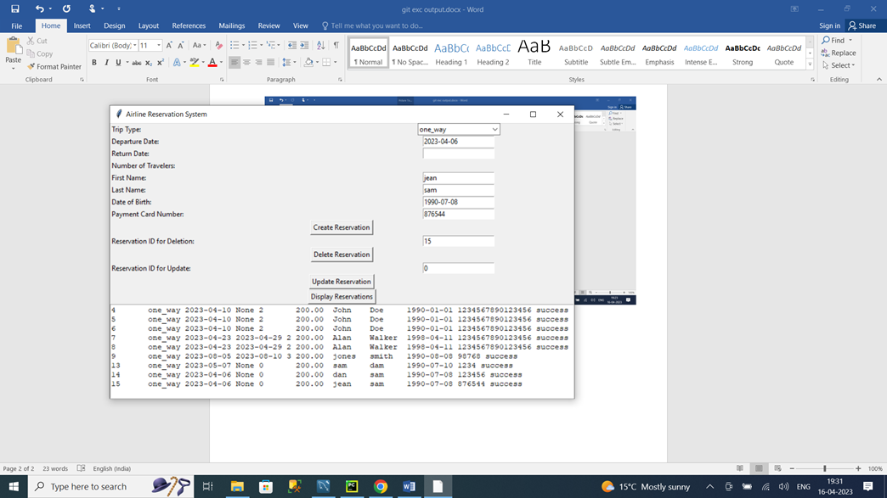

Introduction
Online booking for airline tickets has been made possible through the SMJ Airline reservation system. The system offers a user-friendly interface that enables users to select their trip type (one-way or return), pick departure and return dates, specify the number of travelers, and calculate the total cost based on that number. Together with entering personal data like their first and last names and dates of birth, users can also make payments online with a credit or debit card. The system also stores all of the data entered by users in a MySQL database for the purpose of maintaining records and generating reports. For managing reservation data, the system offers the fundamental CRUD (Create, Read, Update, and Delete) functions of data entry, data retrieval, data update, and data deletion. In order to guarantee data accuracy and consistency, the system additionally includes validation and integrity checks. Overall, the SMJ Airline reservation system strives to offer users a simple and quick way to purchase airline tickets online while upholding the confidentiality and integrity of their personal information.

// CREATE DATABASE smj_airline_reservstion; //

The above code is showing the creation of the database which has been implemented in the MySQL Workbench. This is the very first step of the project first the database needs to create and the table and the rest of the GUI need to be implemented later.

CREATE TABLE `reservations` (
  `id` int NOT NULL AUTO_INCREMENT,
  `trip_type` enum('one_way','return') DEFAULT NULL,
  `departure_date` date DEFAULT NULL,
  `return_date` date DEFAULT NULL,
  `num_travelers` int DEFAULT NULL,
  `total_amount` decimal(10,2) DEFAULT NULL,
  `first_name` varchar(50) DEFAULT NULL,
  `last_name` varchar(50) DEFAULT NULL,
  `date_of_birth` date DEFAULT NULL,
  `payment_card_number` varchar(16) DEFAULT NULL,
  `reservation_status` enum('success','pending','failed') 

The above code represents an SQL query to create a table named “reservations” in a MySQL database. 
The table has several columns, including “id” which is an auto-incrementing primary key, “trip_type” which has “one_way” or “return”, values. “departure_date” and “return_date” which are of DATE data type. Besides this, all the entity has been created have unique IDs on the database.

Frontend Implementation (GUI)

conn = mysql.connector.connect(
    host="localhost",
    user="root",
    password="12345",
    database="smj_airline_reservation"
)
cursor = conn.cursor()

The  code snippet obtained from MySQL Workbench. It shows how to connect to a MySQL database using Python's MySQL.connector module. 
The code establishes a connection to the database by specifying the host (localhost), the user (root), the password (sunshine), and the database name (smj_airline_reservation). 
A cursor object is created to interact with the database. 
Proper exception handling and closing of the database connection are important for secure and efficient database operations.

def create_reservation():
    trip_type = trip_var.get()
    departure_date = departure_var.get()
    return_date = return_var.get()
    num_travelers = num_travelers_var.get()
    total_amount = 200.00 if trip_type == "one_way" else 300.00
    first_name = first_name_entry.get()
    last_name = last_name_entry.get()
    date_of_birth = dob_entry.get()
    payment_card_number = card_entry.get()
    reservation_status = "success"
    try:
        sql = "INSERT INTO reservations (trip_type, departure_date, return_date, num_travelers, total_amount, first_name, last_name, date_of_birth, payment_card_number, reservation_status) " \
              "VALUES (%s, %s, %s, %s, %s, %s, %s, %s, %s, %s)"
        values = (
        trip_type, departure_date, return_date, num_travelers, total_amount, first_name, last_name, date_of_birth,
        payment_card_number, reservation_status)
        cursor.execute(sql, values)
        conn.commit()
        messagebox.showinfo("Success", "Reservation created successfully!")
    except Exception as e:
        messagebox.showerror("Error", str(e))

The above code is a Python function that inserts reservation details into a MySQL database using MySQL Workbench. 
The function retrieves values from various Tkinter widgets (such as trip_type, departure_date, return_date, etc.) and calculates the total_amount based on the trip_type. 
It then constructs an SQL query with placeholders for the values to be inserted into the reservations table. 
The function uses a try-except block to handle exceptions, such as errors during the SQL execution. 
If the insertion is successful, a message box displays a success message. 
If an error occurs, an error message box shows the error message. 
The function uses the execute() method to execute the query and the commit() method to commit the changes to the database.

The above code has been implemented to get the proper formation of the database to the update reservation. 
The function retrieves values from various Tkinter widgets (such as reservation_id, trip_type, departure_date, return_date, etc.) and calculates the total_amount based on the trip_type.
It then constructs an SQL query with placeholders for the values to be updated in the reservations table, with the reservation_id as the condition for updating.
The function uses a try-except block to handle exceptions, such as errors during the SQL execution. 
The method has developed that If the update is successful, a message box displays a success message and If the error occurs, an error message box shows the error message.
The function uses the execute() method to execute the query and the commit() method to commit the changes to the database

The above figure shows the graphical representation of the code which has been implemented in the pycharm with the help of a developed database. 
The Tkinter library has been used to implement the graphical user interface. 
There are several sections available in the GUI such as creating a reservation, delete a reservation, updating a reservation, showing a reservation, and deleting a reservation. 
The create reservation has various text boxes to give details of the airline system to book the ticket.

The display reservation button shows the all information in the table which are presented in the dataset. 
The above figure is showing a table representing the developed GUI by using Python as the front end and MySQL workbench as the backend.